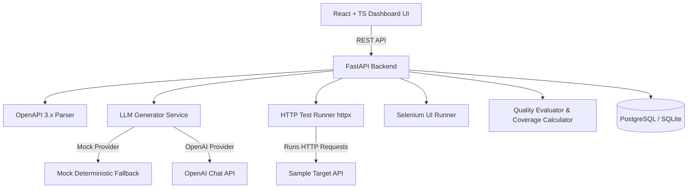

# TestPilot

TestPilot is a small platform I built to experiment with using LLMs for API test generation.

Writing integration, edge-case, and security tests for APIs by hand gets tedious fast. TestPilot takes an OpenAPI spec (JSON or YAML), extracts endpoints and schema rules, feeds that context to an LLM with strict JSON schema enforcement, executes those tests against a target API, and scores test quality and API coverage.

The UI is designed to feel like a developer tool (think Postman meets Playwright and GitHub Actions) rather than a generic landing page.

---

## Architecture



### Core Components

- **OpenAPI 3.x Parser (`backend/app/parsers/openapi_parser.py`)**: Reads JSON/YAML specs, resolves internal `$ref` pointers, and maps paths, methods, parameters, and bodies into clean internal models.
- **LLM Test Generator (`backend/app/llm/`)**:
  - `OpenAIProvider`: Calls OpenAI-compatible chat endpoints enforcing JSON schema output and validating results against Pydantic models.
  - `MockLLMProvider`: Deterministic fallback generator so the entire app runs out-of-the-box without needing an OpenAI key.
  - `TestGenerator`: Handles provider lookups, retries on malformed JSON, and gracefully falls back to mock generation if the LLM API times out.
- **Test Runners (`backend/app/runners/`)**:
  - `HTTPTestRunner`: Builds full URLs, substitutes path parameters (`/users/{id}` -> `/users/1`), transmits headers/params/bodies via `httpx`, measures response latency, and evaluates assertions (`status_code`, `header_exists`, `json_field_equals`, `response_time_below`).
  - `SeleniumTestRunner`: Runs headless browser steps (navigate, input, click, assert text) and saves screenshots on failure.
  - `SSRF Guard`: Blocks private IP ranges and localhost targets unless `ALLOW_LOCAL_TARGETS=true` is set for local testing.
- **Quality & Coverage Engines (`backend/app/evaluators/`)**:
  - `QualityEvaluator`: Scores test cases from 0-100 across Correctness (35%), Consistency (20%), Coverage (30%), and Usability (15%).
  - `CoverageCalculator`: Tracks endpoint, method, parameter, and negative test coverage metrics.
- **Sample Target API (`examples/sample_api/`)**: A small built-in FastAPI app with User CRUD and Auth endpoints used for self-testing and local execution demos.

---

## Running Locally

### Prerequisites
- Python 3.11+
- Node.js 18+

### 1. Backend Server

```bash
cd backend
python -m venv venv
source venv/bin/activate  # On Windows: venv\Scripts\activate
pip install -e .[dev]

# Start FastAPI server on port 8000
uvicorn app.main:app --reload --port 8000
```

### 2. Sample Target API (for self-testing)

```bash
# In a new terminal
uvicorn examples.sample_api.main:app --reload --port 8001
```

### 3. Frontend Dashboard

```bash
cd frontend
npm install
npm run dev
```

Open [http://localhost:3000](http://localhost:3000) in your browser.

---

## Running with Docker

Bring up PostgreSQL, Redis, Backend, Frontend, and Sample API in containerized mode:

```bash
docker compose up --build
```

- Dashboard: [http://localhost:3000](http://localhost:3000)
- Backend Swagger API Docs: [http://localhost:8000/api/docs](http://localhost:8000/api/docs)
- Sample Target API Docs: [http://localhost:8001/docs](http://localhost:8001/docs)

---

## Self-Testing Workflow

1. Go to [http://localhost:3000](http://localhost:3000).
2. Click **New Project** and name it `"Sample E-Commerce API"` with base URL `http://localhost:8001`.
3. Click **Upload Spec** and paste the contents of `examples/sample_api/openapi.json`.
4. Go to **API Endpoints** and click **Generate AI Tests**.
5. Go to **Generated Tests** to review generated test cases (Functional, Negative, Edge, Security).
6. Click **Run All Tests** to execute the test suite against the target API.
7. Inspect the pass/fail results, assertions log, response latency, quality evaluation scores, and coverage metrics.

---

## Automated Tests

To run the Pytest unit and integration suite:

```bash
cd backend
pytest -o pythonpath=. -v
```

---

## Limitations & Trade-offs

- **LLM outputs still need review**: LLM-generated tests are assigned an initial status of `generated_needs_review`. The model can hallucinate expected values or miss business context, so TestPilot lets you edit assertions before executing.
- **OpenAPI spec dependency**: Test generation quality depends heavily on how detailed your OpenAPI spec is. If your spec lacks parameter types or schema properties, the generated tests will naturally be basic.
- **Coverage is API surface coverage**: Coverage metrics measure endpoint, HTTP method, and parameter combinations declared in the spec — not internal Python code line coverage (like `pytest-cov`).
- **Selenium support is simple**: The Selenium runner targets basic step sequences (navigate, click, type, assert text). It is isolated from the HTTP engine and isn't intended for complex single-page apps with shadow DOMs.
- **Intended for dev/test environments**: TestPilot is designed for local dev and staging test execution rather than running directly against production environments.
